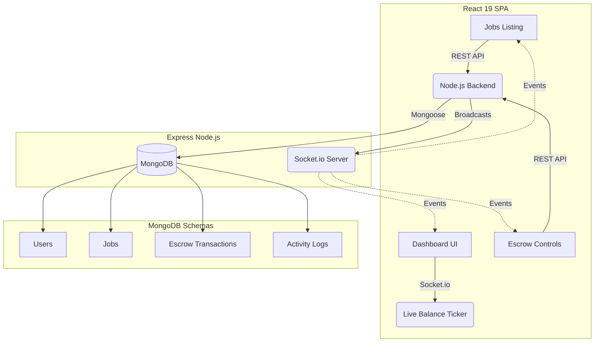

<div align="center">
  
</div>

<h1 align="center">AICrypto Pay</h1>

<p align="center">
  <strong>The Next-Generation AI-Driven Cryptocurrency Payment Gateway</strong>
</p>

<p align="center">
  
  
  
  
  
  
</p>

---

## 🚀 Overview

**AICrypto Pay** is an interactive, real-time web application built to simulate and explore a futuristic AI-driven cryptocurrency payment ecosystem. The application integrates modern frontend design paradigms with a robust **MongoDB backend**, RESTful APIs, and real-time web socket data to emulate live blockchain transactions, smart contract validations, and automated job/milestone tracking.

This project features true backend Escrow Accounting logic. Clients can lock funds which transition into an escrow balance, and eventually get released or refunded based on the AI Oracle arbitration consensus.

---

## 🏗 Architecture Diagram



---

## 🏗 Architecture & Stack

This application is built with a **Full-Stack SPA** architecture, decoupling modern frontend components from a robust Node.js express backend server that handles data persistence and real-time synchronization.

### 🎨 Frontend
* **Core:** [React 19](https://react.dev/) + [TypeScript](https://www.typescriptlang.org/)
* **Build Tool:** [Vite](https://vitejs.dev/)
* **Styling:** [Tailwind CSS v4](https://tailwindcss.com/)
* **Animations:** [Framer Motion](https://www.framer.com/motion/)
* **Icons:** [Lucide React](https://lucide.dev/)

### ⚙️ Backend & Real-Time Sync
* **Server:** [Express.js](https://expressjs.com/) built on Node.js running `server.ts`.
* **Database:** **MongoDB** with **Mongoose** ORM for robust data persistence.
* **WebSockets:** [Socket.IO](https://socket.io/) - Used to broadcast live simulated blockchain transactions (`live_blockchain_activity`), new job posts, and milestone updates globally across all connected clients.
* **REST API:** Handles full CRUD operations for Jobs, Users, and Escrow Transactions.

---

## ✨ Features

* **Escrow Logic Accounting:** Strict transition rules for moving funds from Client Wallets -> Pending Escrow -> Freelancer Withdrawals.
* **Live Global Dashboard:** Real-time stream of simulated Web3 events (e.g. *Safe Treasury locks*, *Oracle validators*, *Cold storage audits*) synchronized across all browser instances.
* **Crypto Job Board:** Post, fund, dispute, and release crypto jobs safely.
* **Dynamic Animations:** A premium, "wow-factor" visual aesthetic featuring deep dark modes, glowing gradients, and fluid layout transitions.
* **Responsive Design:** Completely optimized for both desktop and mobile layouts.

---

## 🛠 How to Run Locally

### Prerequisites
Make sure you have [Node.js](https://nodejs.org/) (v18+ recommended) and **MongoDB** installed on your system.

### 1. Clone & Install
```bash
# Install NPM dependencies
npm install
```

### 2. Configure Environment
Copy the example environment file:
```bash
cp .env.example .env
```
Open `.env` and set your MongoDB connection string (defaults to local):
```env
MONGODB_URI="mongodb://127.0.0.1:27017/alcrypto-pay"
PORT=3000
```

### 3. Start the Development Server
The `dev` script concurrently starts both the Vite frontend server and the Express backend.
```bash
npm run dev
```
> Your app will now be running live at **http://localhost:5173** (or the port specified in your console).

---

## 📦 Building for Production

To create an optimized production build:

1. **Build the bundle:**
   ```bash
   npm run build
   ```
   *This compiles the React frontend into static files and uses `esbuild` to compile the Express server into a standalone `server.cjs` script.*

2. **Start the production server:**
   ```bash
   npm run start
   ```

---

<p align="center">
  <i>Built with ❤️ for the future of Web3 & AI.</i>
</p>
